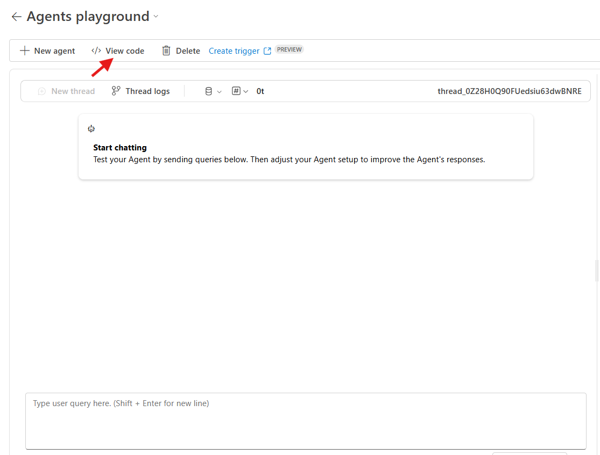

# Multi-Agents System Sample with Azure AI Foundry and Semantic Kernel

A Python sample demonstrating a concurrent AI agents architecture using [Microsoft Semantic Kernel](https://github.com/microsoft/semantic-kernel) and [Azure AI Foundry](https://learn.microsoft.com/azure/ai-foundry/). This sample creates multiple specialized AI agents that work together to handle different aspects of a restaurant ordering system.

## 🌟 Features

- **Concurrent Agent Execution**: Multiple AI agents running simultaneously
- **Azure AI Foundry Integration**: Leveraging Azure's AI Foundry services for Agentic AI capabilities
- **Semantic Kernel Framework**: Built on Microsoft's Semantic Kernel for agent orchestration
- **Restaurant Use Case**: Practical example with customer service, order management, and allergen checking

## 🏗️ Architecture

The sample includes three specialized agents:

1. **Customer Welcome Agent**: Greets customers and provides restaurant information - natively built using Semantic Kernel
2. **Orders Manager Agent**: Handles order processing and management - imported from Azure AI Foundry via agent id
3. **Allergen Checker Agent**: Analyzes orders for potential allergens - natively built using Semantic Kernel

## 📋 Prerequisites

- **Python 3.8+** (Python 3.13 recommended)
- **Azure AI Foundry** project with an Azure OpenAI deployed model and an AI Agent 
- **Azure CLI** ( for authentication)
- **Git** (optional, for cloning the repository)

## 🚀 Quick Start

### 1. Set up your Azure AI Foundry Agent
1. Navigate to the [Azure AI Foundry portal](https://ai.azure.com).
2. Individuate and click the **Create an agent** button.

3. Name your Azure AI Foundry project and select **Create**.
4. Select the 'gpt-4o' model instance pre-deployed for you and click on **Create**.
5. An Agent will be created for you. Click on it to customize the agent's name, description, instructions and tools. Here's some hints:
    - **Name**: Contoso Pizzeria Orders Manager Agent
    - **Description**: An agent to assist with restaurant orders mangement
    - **Instructions**: Provide detailed instructions on how the agent should interact with customers, and handle orders.
    - **Tools**: You can add tools like a custom api schema via OpenAI 3.0 connector, to handle specific tasks like creating and checking order status.


### 2. Open Repo in a GitHub Codespace
1. Open this repository in a GitHub Codespace by clicking the button below:
   [](https://github.com/codespaces/new?hide_repo_select=true&machine=basicLinux32gb&repo=1007663217&ref=main&devcontainer_path=.devcontainer%2Fdevcontainer.json&geo=UsEast)
2. Wait for the Codespace to initialize. This may take a few minutes as it sets up the environment.

### 3. Configure Environment Variables

1. **Copy the sample environment file:**
   ```bash
   cp .env.sample .env
   ```

2. **Edit the `.env` file** with your Azure AI Foundry credentials:
   ```bash
   AZURE_OPENAI_DEPLOYMENT_NAME=your-deployment-name
   AZURE_OPENAI_ENDPOINT=https://your-resource.openai.azure.com/
   AZURE_OPENAI_API_KEY=your-api-key
   AZURE_AI_AGENT_ID=your-agent-id
   AZURE_AI_AGENT_ENDPOINT=https://your-agent-endpoint
   ```
   You can find the Azure OpenAI specifics in the **Overview** section of your Azure AI Foundry project.
   

   For the Azure AI Agent values, navigate to the **Agents** section of your Azure AI Foundry project and click on the agent you want to use. The **Agent ID** will be displayed in the **Setup** tab, that will be opened on the right side of the page.
   

   Then click on the **Try in playground button** to open the playground in full screen, where you can navigate to the code view through the **View Code** button.
   


### 4. **Authenticate with Azure CLI**
Open a terminal in your Codespace and run:

   ```bash
   az login
   ```
Follow the prompts to authenticate with your Azure account.

### 5. Run the Sample

```bash
python concurrent_agents.py
```

### Environment Variables Explanation

| Variable | Description | Example |
|----------|-------------|---------|
| `AZURE_OPENAI_DEPLOYMENT_NAME` | Name of your deployed model | `gpt-4o` |
| `AZURE_OPENAI_ENDPOINT` | Your Azure OpenAI endpoint URL 
| `AZURE_OPENAI_API_KEY` | Authentication key for Azure OpenAI 
| `AZURE_AI_AGENT_ID` | Azure AI Agent ID 
| `AZURE_AI_AGENT_ENDPOINT` | Azure AI Agent endpoint

## 💡 Usage Examples

### Basic Usage

```bash
python concurrent_agents.py
```

When prompted, enter your order:
```
Please specify your order for Contoso Pizzeria: I'd like 1 pepperoni pizza and 2 margheritas
```

### Expected Output

```
🚀 Running agents concurrently...

# CustomersWelcomeAgent:
Welcome to Contoso Pizzeria! We're delighted to serve you...

# OrdersManagerAgent:
I've processed your order for a large pepperoni pizza and Caesar salad...

# AllergenCheckerAgent:
Allergen Analysis: The pepperoni pizza contains gluten, dairy...
```

## 📁 Project Structure

```
azure-ai-multi-agents-sample/
├── .devcontainer/          # Dev container configuration
├── .env.sample            # Environment variables template
├── .gitignore            # Git ignore rules
├── README.md             # This file
├── concurrent_agents.py  # Main application
└── requirements.txt      # Python dependencies
```

## 🔄 Customization

### Adding New Agents

1. Create a new agent in the `main()` function:
```python
new_agent = ChatCompletionAgent(
    name="YourAgentName",
    description="Description of what the agent does",
    instructions="Detailed instructions for the agent",
    kernel=create_kernel()
)
```

2. Add to the orchestrator:
```python
orchestrator = ConcurrentOrchestration(
    members=[existing_agent, new_agent]
)
```

### Modifying Agent Instructions

Edit the `instructions` parameter for each agent to customize their behavior:

```python
instructions="Your custom instructions here..."
```

## 📚 Additional Resources

- [AI Agents for beginners course](https://github.com/microsoft/ai-agents-for-beginners)
- [AI and Agents tutorials](https://github.com/azure-ai-foundry/ai-tutorials)

## 🤝 Contributing

1. Fork the repository
2. Create a feature branch
3. Make your changes
4. Test thoroughly
5. Submit a pull request

## 📄 License

This project is licensed under the MIT License - see the LICENSE file for details.

## ⚠️ Important Notes

- **API Costs**: Running this sample will consume Azure OpenAI tokens and incur costs
- **Rate Limits**: Be aware of Azure OpenAI rate limits for your subscription tier
- **Security**: Never commit your `.env` file with real credentials to version control
- **Updates**: Semantic Kernel is actively developed; some APIs may change between versions

## 🆘 Support

If you encounter issues:

1. Create an issue in this repository with detailed error information
2. Open a discussion for general questions or feedback on Azure AI Foundry usage in the [AI Foundry developer forum](https://github.com/orgs/azure-ai-foundry/discussions)
3. Join the [AI Foundry Discord community](https://discord.com/invite/azureaifoundry) for real-time support and discussions